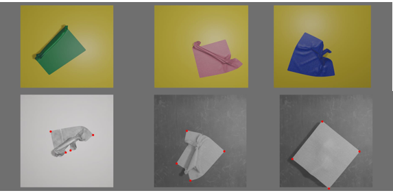
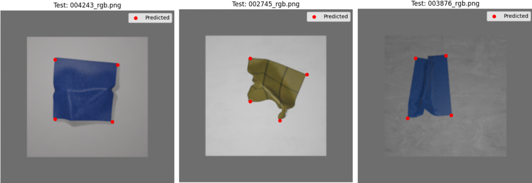
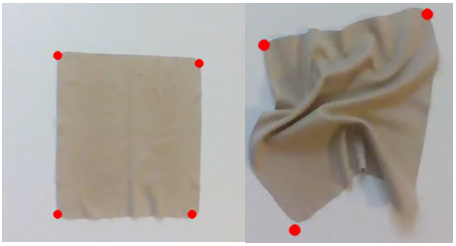
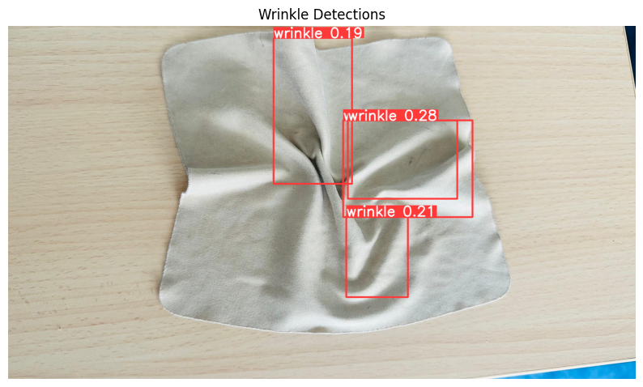
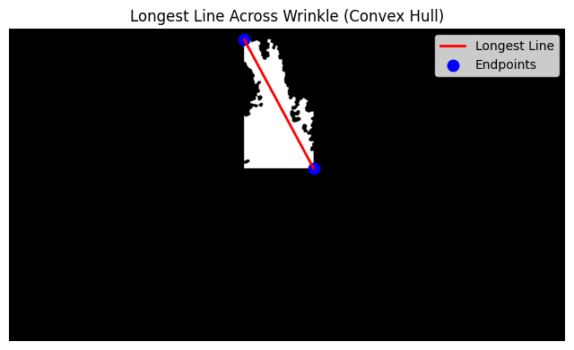

# CV Keypoints and Wrinkle Detection in Textiles

## 📖 Overview
This repository allows you to train and evaluate deep learning models designed to identify keypoints (corners) and segment wrinkles in textiles. The ultimate goal is to find the best grasping points to unfold a piece of cloth using a robotic arm.

The repository is organized into four main directories, each serving a specific purpose in the pipeline: from synthetic dataset generation to real-time evaluation.

---

## 📂 Repository Structure

### 1. `Towel-scenes-custom/`
This directory contains scripts to generate virtual scenes using **Blender 2.80**. 
* It generates synthetic datasets of cloths in various folding positions, colors, and textures.
* It outputs the annotations in a **COCO-style JSON file** required for training the models.
* **Colab Notebook for Training:** You can train the keypoint detection model using the generated dataset here: [Keypoints Training Notebook](https://colab.research.google.com/drive/1vDwQTSIpFn1aj6c4Ux8AAtADVSatG2aI?usp=sharing).
* **Credit:** The towel scene generation code is adapted from: [https://github.com/priyasundaresan/cloth-rendering](https://github.com/priyasundaresan/cloth-rendering).

**Synthetic Dataset Example (Blender-generated):** 

### 2. `keypoint-detection/`
This directory is dedicated to the detection of the towel's corners (up to 4 keypoints). It contains the final trained model and scripts for both static and real-time evaluation.
* **`best_heatmap.pth`**: The final pretrained model based on heatmaps.
* **`eval.py`**: Script to statically evaluate the pretrained model on test images.
* **`realtime_keypoints.py`**: Script for real-time visualization of detected keypoints using an **Intel RealSense RGBD camera**.

**Keypoints Evaluation:** 

**Real-Time Keypoints Detection:** 

### 3. `wrinkle-segmentation/`
This directory focuses on detecting and analyzing wrinkles on the cloth. 
* **How the Algorithm Works**: The pipeline uses a YOLOv8 model to detect bounding boxes around wrinkles. It then applies computer vision techniques (Edge detection and Morphological operations) inside the detected regions to extract the contours. Finally, it identifies the longest contour, uses a Convex Hull to find the farthest points within that contour, and draws a line to determine the maximum length of the main wrinkle.
* **Dataset & Training**: The YOLOv8 model was trained on the [Wrinkle Detector 2.0 Dataset](https://universe.roboflow.com/fabric-accessor/wrinkle-detector-2.0) hosted on Roboflow. To improve the model's performance, this dataset was augmented with a custom dataset of 400 synthetic digital images generated in Blender. The wrinkles in these synthetic images were manually annotated using [AnyLabeling](https://github.com/vietanhdev/anylabeling).
* **Colab Notebooks**:
    * [Wrinkle Training Notebook](https://colab.research.google.com/drive/1Kn5kF8jvKpI50eObxHSCjKAVuxXxTHC1?usp=sharing)
    * [Wrinkle Static Inference Notebook](https://colab.research.google.com/drive/12kBpE8gECRDdIp1zmT7XGCZ3YESo1MEW?usp=sharing)

**Wrinkle Segmentation Results:** 

### 4. `test_dataset_keypoints_wrinkles/`
This directory contains scripts specifically designed to test both methods (keypoints and wrinkles) on purely digital datasets generated via Blender. It reads the raw simulated images, runs the models, and outputs the bounding boxes, segmentations, and keypoint visualizations into separate subfolders for analysis.

---

## 🔧 Environments & Dependencies

It is highly recommended to use **Conda** to manage dependencies. Because there are conflicts between specific versions of `numpy` and `ultralytics` required by the different models, **two separate Conda environments are used**.

1.  **Keypoints Environment**: Use the `env.yml` located inside the `keypoint-detection/` directory.
2.  **Wrinkles Environment**: Use the `env.yml` located inside the `wrinkle-segmentation/` directory.

Both environments include the necessary support and libraries to run real-time detections using an **Intel RealSense RGBD camera**.
